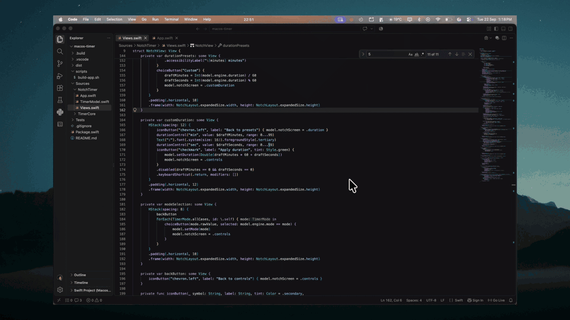

# settime

A minimal timer and stopwatch for macOS, built with SwiftUI and AppKit. Hover to reveal controls, make an adjustment, and move away to return to the compact notch.



## Features

- **One compact control strip** — adjust everything directly inside the notch.
- **Compact progress fill** — the timer fills green from left to right while running and turns red when stopped. The expanded strip stays black; a running stopwatch uses a solid green tint.
- **Timer and stopwatch** — quick presets or a custom duration from 1 second to 99:59.
- **Hover interaction** — controls stay open while you use them and collapse when you leave.
- **Drag to position** — move the compact notch or expanded strip anywhere on your displays; its position is saved.
- **Subtle animation** — smooth transitions with support for Reduce Motion.
- **Timer sounds** — `start.m4a` and `pause.mp3` play when a session starts or pauses, `stop.mp3` when you reset an active or paused session, and `times-up.mp3` when a countdown completes. The completion sound can be toggled from the controls. No sounds play on button clicks.
- **Native** — SwiftUI and AppKit, no accounts or Dock icon. Sparkle checks for app updates over HTTPS; timer data stays local.
- **App updates** — check from the menu bar, or toggle automatic checks. Install and Relaunch restarts automatically and restores the timer or stopwatch session.
- **Focus Mode for Chrome** — optionally block distracting websites during countdowns with a companion extension. Existing tabs are covered without closing or reloading them.

## Get started

Requires **macOS 14+** and a **Swift 6 toolchain** (Xcode or Command Line Tools).

```sh
git clone https://github.com/Samie-ub/notch-timer.git
cd notch-timer
bash scripts/build-app.sh
open dist/settime.app
```

The build script creates a locally signed app in `dist/`. For development, run `swift run` or open `Package.swift` in Xcode.

## Controls

| Action | How |
| --- | --- |
| Reveal controls | Hover over the notch or click the time |
| Start or pause | Click the play/pause button |
| Change duration | Click the time, then choose a preset or **Custom** |
| Apply custom time | Click the checkmark or press Return |
| Switch modes | Click the mode name and choose Timer or Stopwatch |
| Reset or toggle completion sound | Use the reset or speaker button |
| Collapse | Move away from the notch or press Escape |
| Move the notch | Click and drag the compact notch or expanded strip |
| Reset position | Choose **Reset Notch Position** from the menu bar icon |
| Quit | Use the timer icon in the menu bar |

Pause before changing mode or duration. Unapplied custom-time changes are discarded when the strip closes. Ordinary quits discard active sessions; update restarts restore them.

## Focus Mode setup

1. Build the app and keep `dist/settime.app` in its final location (or copy it to Applications before setup).
2. Launch that build, then click the **target icon** in the notch controls, or choose **Focus Mode…** from the menu bar menu.
3. Expand **Connect Chrome · one-time setup** and click **Show Extension Folder**.
4. In Chrome, open `chrome://extensions`, enable **Developer mode**, choose **Load unpacked**, and select that `browser-extension` folder.
5. Copy the extension's ID into Focus Mode settings and click **Connect Chrome**. The extension popup should say **Bridge connected**.
6. Add websites, enable Focus Mode, and start a countdown. Stopwatch mode does not block sites.

Domains include subdomains; pasting a URL adds its entire host. To block both `youtube.com` and `www.youtube.com`, add `youtube.com`. Pause, reset, completion, disabling Focus Mode, and quitting release access, normally within one second. If the app crashes or stops responding, its four-second lease expires. Chrome suspension can delay cleanup until the browser resumes; a watchdog and focus-page checks recover it.

New GET page navigations redirect to a focus page. Existing web pages receive a removable modal cover, preserving forms and page state. Form submissions are not redirected. Browser-internal pages, other browsers, and incognito (unless explicitly enabled in Chrome) are outside this feature's scope. Existing audio/video may continue beneath the cover. This is voluntary focus assistance, not a tamper-resistant website filter.

The extension needs HTTP(S) site access to cover existing pages and redirect new visits. It does not send browsing history to the app or a server. The app shares only the selected domains and an expiring timer state through a local native messaging helper. There is no Accessibility permission requirement.

If you move the app, reconnect Chrome so the helper path is updated. After rebuilding, reload the extension in `chrome://extensions` to apply its updated visuals and icon. To uninstall, remove the extension in Chrome; optionally delete `~/Library/Application Support/Google/Chrome/NativeMessagingHosts/com.local.notchtimer.focus.json`. Removing the extension immediately removes its request rules; reload an existing covered tab if Chrome leaves its injected cover visible.

The notch starts centered on the primary display, below the camera cutout on Macs that have one. Drag it to reposition it; expansion and collapse keep your chosen position, with adjustments at screen edges to keep all controls visible. Adjust its dimensions and top spacing in [`NotchLayout`](Sources/NotchTimer/App.swift).

## Updating the app

Install an updater-enabled build once, then use **Check for Updates…** in the menu bar.
**Automatically Check for Updates** can be toggled there too. Updates are verified with
Sparkle's Ed25519 signatures; no Apple Developer membership is required. Without Apple
Developer ID signing and notarization, downloaded first-time installs may need manual
approval in macOS Privacy & Security. Plain `swift run` disables the update menu because
it is not an installed app bundle.

Selecting **Install and Relaunch** restarts the app automatically. Running timers and
stopwatches resume with restart time included; paused sessions stay paused. A countdown
that ends during the restart returns completed. Ordinary quits still discard the session.
Automatic silent installation is disabled.

The update feed uses the `appcast.xml` asset on the latest GitHub Release. It becomes
available after the first release is published; until then checks report a feed error.
See [release instructions](docs/updates.md) for preparing and publishing signed updates.

## Development

```sh
swift test --disable-sandbox
bash scripts/build-app.sh
node --test Tests/BrowserFocus/extension.test.mjs
python3 Tests/BrowserFocus/native-host.test.py
```

Timer logic lives in `Sources/TimerCore`; the macOS interface lives in `Sources/NotchTimer`. Tests cover timing, pause/resume, completion, mode changes, and formatting.

Focus Mode policy and lease tests live alongside timer tests. `tools/browser-focus-host` implements Chrome's length-prefixed JSON protocol, and `browser-extension` contains the Manifest V3 companion. The build bundles both into the app. The helper is compiled separately, so `swift run` continues to launch only Notch Timer. Extension tests exercise rule cleanup, disconnects, malformed sessions, expiry, and queued updates; helper tests exercise framing and invalid input.

For a manual end-to-end check, leave an unsaved draft on a listed site, start a countdown, and verify both that the draft is covered and that a new visit redirects. Pause and confirm the draft remains, then check reset, completion, quit, app crash, Chrome restart, and extension reload. Verify that unlisted sites and the notch controls remain usable.
